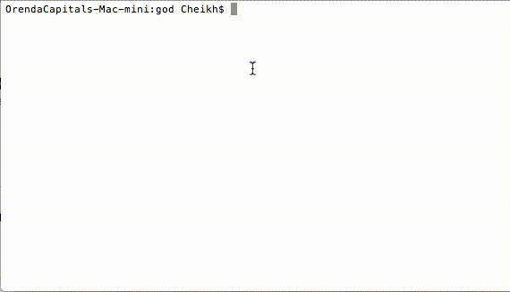

# Go Debug
Go syntax checker.

It is a command line tool that simplifies finding and fixing Go syntax issues.

# Install

	go get github.com/cheikhshift/god

# Usage

	god <go files>...

# Sample 

